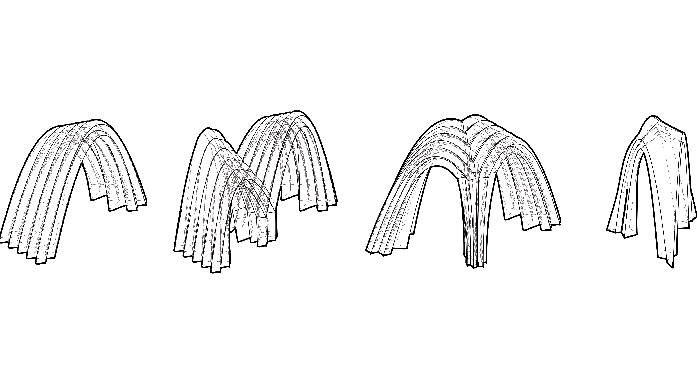
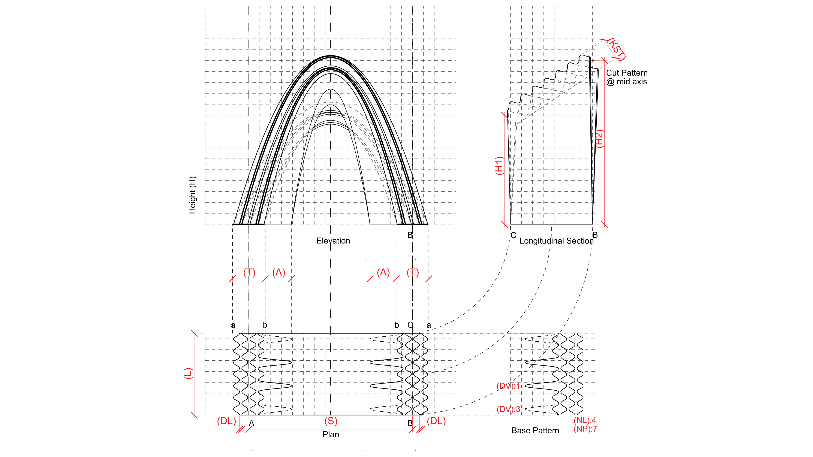
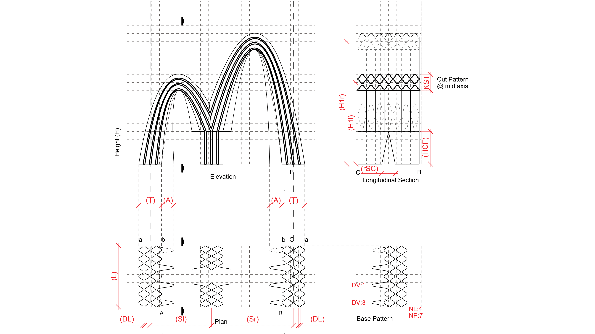
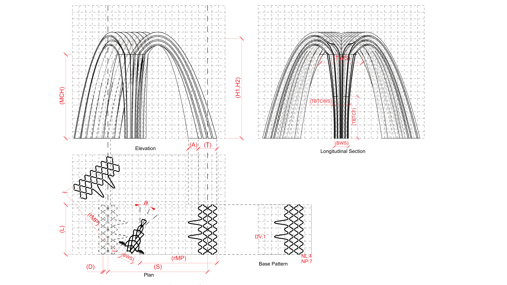

# Rigidity-Via-Geometry-Embedding-Structural-Intelligence-within-3D-Printed-Vaulted-Structures
Team member(s): Kevin Mwangi Njoroge, Milad Mehdizadeh and Javad Norouzi

Abstract

Architectural history contains numerous examples of vaulted  structures built using a variety of design techniques and a range of materials, to serve or host different functions. One recurring function is the role of the vault as a roofing element, in part or whole.

Additive manufacturing/3d printing as a new method of construction has been used successfully to construct self-supported load-bearing elements like walls and columns using concrete and clay extrusions. However, with gravity as a limiting factor, the construction of self-supporting horizontal-spanning structures such as roofs or slabs have not quite received the gains of this new technology. The question therefore looms. How can extrudable clay be used within the realms of additive manufacturing/ 3D printing to contribute to the construction of vaulted self-supporting structures that can satisfy the 5th facade requirements?

- This code is developed as part of the project [Rigidity Via Geometry: Embedding Structural Intelligence within 3D Printed Vaulted Structures](https://blog.iaac.net/rigidity-via-geometry-embedding-structural-intelligence-within-3d-printed-vaulted-structures/).

## Requirements
* Rhinoceros 7 or later.
* Grasshopper 3d plugin for Rhinoceros.
* Pufferfish plugin for grasshopper.

`This code has been tested on Rhinoceros on windows`

## Getting started
- You can use the .gh file from scripts folder without any Rhino input

## Workflow
- In the following diagrams, you can see the parameters to process your vault in each pase.
## Phase 1 : Fundamental parameters as a setup for a vault
- (L): wall Length
- (T): wall base Thickness
- (NL): Number of infill Layers
- (DL): Distance between the Layers
- (NP): Number of the Periods
- (KST): Thickness of the Key-Stone
- (DV): Deviation
- (A): Length of ribs Advance 
- (H1): 1st Height of the vault
- (H2): 2nd Height of the vault
- (S): Span of the vault

## Phase 2 : Fusion of vaults

the merging of vaulted geometries of same or different parametric configurations, by pushing their sides against each other, to create a single unified geometry.

Class one: Interconnected spaces with inequal heights

- (L): wall Length
- (T): wall base Thickness
- (NL): Number of infill Layers
- (DL): Distance between the Layers
- (NP): Number of the Periods
- (KST): Thickness of the Key-Stone
- (DV): Deviation
- (A): Length of ribs Advance 
- (H1r): 1st Height of the vault R
- (H1l): 1st Height of the vault L
`In This case, It is recommended to put equal values for H1 and H2`
- (Sr): Span of the vault R
- (Sl): Span of the vault L
- (rSC): relative Size of the Connection
- (HCF): Height of the Connection Frame

Class two: Separate spaces with equal heights
- (L): wall Length
- (T): wall base Thickness
- (NL): Number of infill Layers
- (DL): Distance between the Layers
- (NP): Number of the Periods
- (KST): Thickness of the Key-Stone
- (DV): Deviation
- (A): Length of ribs Advance 
- (H1): 1st Height of the vault
- (H2): 2nd Height of the vault
`In This case, It is recommended to put equal values for H1 and H2'
- (S): Span of the vault
- (rMP): Relative parameter of the mirror plane
- (α): Angle of Rotation
- (MCH): Mid Column Height
- (TWS): Top column clipping rectangle Width Scaler
- (BWS): Base column curve Width Scaler
- (TBTCF): Top-Bottom Tween Curve Factor
- (TBTCWS) Top-Bottom Tween Curve Width Scaler

## Phase 3 : Connection of vaults
